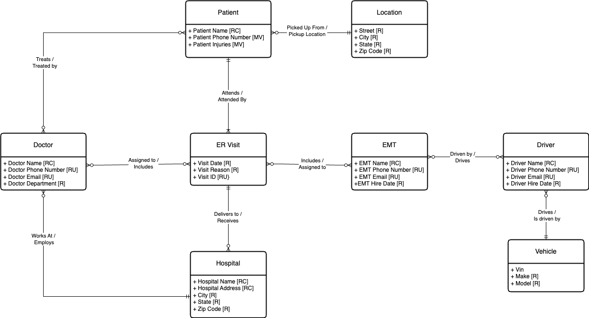
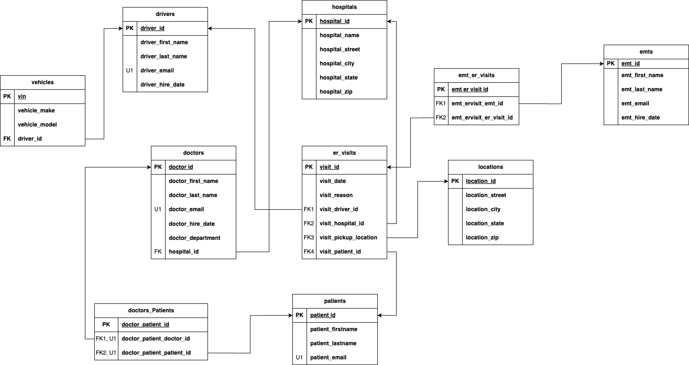

# Emergency Hospital Transportation Database System

**Course:** IST 659 – Data Administration Concepts & Database Management  
**Semester:** Spring 2025  
**Tools/Technologies:** SQL, ER Modeling, Relational Database Design  

---

## Project Overview

This project involved designing a relational database to support an efficient Emergency Transportation System for hospitals. The goal is to streamline how hospitals track emergency calls, assign ambulances, dispatch EMTs and drivers, record patient pickup/drop-off locations, and ensure patients are directed to the nearest appropriate hospital and doctor.

The system replaces unorganized and error-prone paper-based workflows with a structured SQL database that improves coordination, reduces delays, and increases patient care accuracy during emergency events.

---

## Problem Statement

Emergency rooms operate in a chaotic and time-pressured environment. Paper-based processes make it difficult to:

- Assign ambulances, drivers, and EMTs quickly  
- Route patients to the correct hospital  
- Track pickup/drop-off times and locations  
- Assign an appropriate doctor immediately  
- Maintain clear records across many moving parts  

Because errors in emergency response can have life-threatening consequences, a centralized and reliable database is critical for accuracy, organization, and optimized resource allocation.

---

## Proposed Solution

The Emergency Transportation System database:

- Centralizes information about drivers, EMTs, hospitals, vehicles, patients, and locations  
- Supports assignment of a driver, EMT, ambulance, and hospital when a 911 call is logged  
- Tracks patient pickup and delivery times  
- Links each patient to an assigned doctor  
- Helps hospital administrators monitor efficiency and resource usage  
- Facilitates quick access to emergency medical records  

This design enhances emergency care coordination and streamlines communication between all operational users.

---

## Users

The primary end-users are hospital staff and administrators, who rely on the system to:

- Track patient movement from pickup to delivery  
- View assigned drivers, EMTs, vehicles, hospitals, and doctors  
- Monitor response times and identify inefficiencies  
- Justify staffing changes or resource demands  

---

## Schema Overview

### **Entities**

The database is organized into the following core entities:

- **Drivers** – ID, name, contact details, hire date  
- **EMTs** – Emergency medical technicians with identifying details  
- **Doctors** – Includes contact info and department  
- **Patients** – Patient demographics and injury details  
- **Vehicles** – Ambulance information (VIN, make, model)  
- **Locations** – Pickup/drop-off location information  
- **Hospitals** – Hospital name and address  

### **Key Relationships**

- Each patient is assigned a **driver** and an **EMT**  
- Each patient is transported to a specific **hospital**  
- Each patient has a **pickup** and **drop-off** location  
- Each patient is linked to an assigned **doctor**  
- Vehicles are associated with drivers and assigned to emergency calls  

---

## **Conceptual Model Diagram**

## **Logical Model Diagram**

---

## Files Included

- [Project Writeup](documents/final_project_writeup.pdf) 
- [SQL Script](final_up_down.sql) 
- [Conceptal Model Diagram](diagrams/conceptual_model.png) 
- [Logical Model Digram](diagrams/logical_model.png)
- [ER Data Requirements](documents/ER_data_requirements.xlsx)
- [Final Presentation](documents/presentation.pptx)

